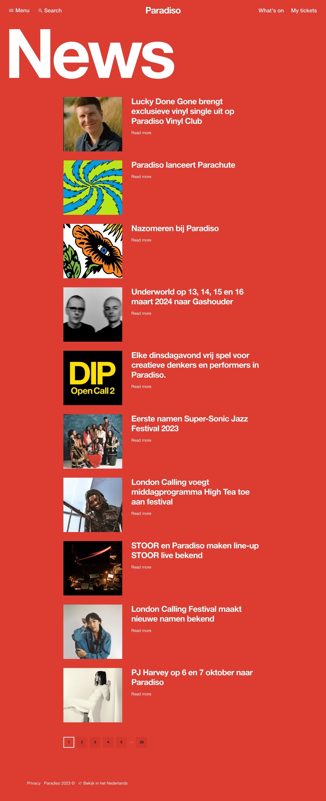

# Procesverslag
Markdown is een simpele manier om HTML te schrijven.  
Markdown cheat cheet: [Hulp bij het schrijven van Markdown](https://github.com/adam-p/markdown-here/wiki/Markdown-Cheatsheet).
Nb. De standaardstructuur en de spartaanse opmaak van de README.md zijn helemaal prima. Het gaat om de inhoud van je procesverslag. Besteedt de tijd voor pracht en praal aan je website.
Nb. Door *open* toe te voegen aan een *details* element kun je deze standaard open zetten. Fijn om dat steeds voor de relevante stuk(ken) te doen.
## Jij

  
uitwerken voor kick-off werkgroep

  ### Auteur:
  Lynn van der Hoorn

  #### Je startniveau:
  Blauw

  #### Je focus:
  Responsive

  
uitwerken voor kick-off werkgroep

  ### Je opdracht:
  link naar de website die je gaat namaken óf de naam/omschrijving van je eigen ontwerp
  https://www.paradiso.nl/en

  #### Screenshot(s) van de eerste pagina (small screen): 
  hier de naam van de pagina  
  

  #### Screenshot(s) van de tweede pagina (small screen):
  hier de naam van de pagina  
  

  ### Bevindingen
  Lijst met je bevindingen die in de test naar voren kwamen:
  De titels zijn half leesbaar op mobiele scherm. Waarschijnlijk een vormgeving dingetje.
  De elementen uit het hamburgermenu staan niet in een list element.
  Heel veel afbeeldingen hebben geen alt-tekst. 
  De code maakt overmatig gebruik van CSS-classes en div-elementen, wat heel makkelijk anders kan.

  De mobiele versie van de website werkt goed. Het is goed scrollbaar en makkelijk te begrijpen.
  Er wordt gebruik gemaakt van video en audio, door middel van  video's (die niet automatisch afspelen, maar door een knop te starten en stoppen zijn) en een spotify lijst hier en   daar.
  Links zijn niet meteen herkenbaar als links, maar het is vrij voor de hand liggend en hebben meestal een hover-effect. Niet alle buttons worden aangegeven met het button-element.
  Er wordt geen gebruik gemaakt van animaties.
  De website heeft een achtergrond kleur en de teksten zijn voornamelijk wit. Er zou dus niet bepaald dark- of light-mode nodig zijn. Op de pagina's waar het scherm wel wit is, is   geen dark-mode aangeboden.
  Ook is er geen optie om de tekstgrootte aan te kunnen passen, maar in principe is alle tekst vrij groot en goed leesbaar.

  
uitwerken na afloop 3e werkgroep

  ### de hele pagina: 
  

  ### dynamisch deel (bijv menu): 
  

  | en dat ook nog | dit als er tijd is | nog een punt | dit wil ik zeker |
  | ...            | ...                | ...          | ...              |

- Tekst responsive krijgen
- Wat moet er	met Javascript gedaan worden?
- Hoe uitgebreid moet de alt tekst zijn?
- Volgorde van heading elementen
- Gebruik van sections articles
- Animaties en hoe doe ik dat eerst in html
- Moet je ook de gehele uitklap menu verwerken?

  ### Verslag van meeting
  hier na afloop snel de uitkomsten van de meeting vastleggen

  - Goed overzicht van hoe section, h's, p's en articles genesteld moeten worden
  - Hoe een navigatie-bar responsive wordt

  | dit bespreken  | en dit             | en ik dit    | en dan ik dat    |
  | en dat ook nog | dit als er tijd is | nog een punt | dit wil ik zeker |
  | ...            | ...                | ...          | ...              |

- Hoe doe je een searchbalk pop up?
- Waarom werkt flexbox niet meer wanneer ik position relative gebruik?
- Mag top/bottom etc. wel?
- Hoe werkt het met de font?
- Hoe krijg je een responsive slideshow van images?
- Mag je bij tekst die over images staan left en right etc. gebruiken?
- Hoe krijg ik de titels korter (om vormgeving redenen) wanneer het scherm kleiner wordt?

- Ik heb nu div’s gezet om de verschillende “kopjes” in de footer, mag dat? Of moet ik er sections van maken?
- Moet ik in de footer na de section ook een h2 zetten met een titel?
- Hoe krijg ik aan de linkerkant van de scherm geen border? Maar tussen de afbeeldingen wel
- Hoe verander ik de style wanneer ik op het invulveld van een forum klik.
- Hoe krijg ik in de footer de laatste afbeelding eronder wanneer het scherm kleiner wordt?
- Hoe zorg ik ervoor dat de tekst in de campaign header ook responsive wordt?
- Hoe zorg ik ervoor dat ik allereerst het plaatje zie en dan pas de tekst? Doe ik dat met order?
- Van een volledig menu naar icoontjes en dat de style verandert, hoe werkt dat?

- Is het handig om flexbox te gebruiken of is left and bottom beter?
- Mag padding gebruikt worden?
- Wanneer ik hover zoom heb op een image, hoe zorg ik dat die tekst hetzelfde blijft?
- @fontface werkt niet?
- Hoeveel javascript moet je hebben?
- Is vijf witregels in css een must of mag je het zelf weten?
- Wanneer ik position relative en absolute gebruik op tekst komt de tekst in elkaar, wat is een goede manier om dit te fixen?

  ### Verslag van meeting
  hier na afloop snel de uitkomsten van de meeting vastleggen
  - Ik weet nu hoe mijn grid in elkaar zit
  - Ik weet nu dat elke section een header moet bevatten, anders wordt het een div
- ...

## Toegankelijkheidstest 2/2 (week 4)

  
uitwerken na test in 9e werkgroep

  ### Bevindingen
  Lijst met je bevindingen die in de test naar voren kwamen (geef ook aan wat er verbeterd is):

  De eerste pagina was goed leesbaar met de screenreader, het las de nav voor als links en de h's, p's en images ook op de goede volgorde. Images moeten alleen nog link element bevatten

## Voortgang 3 (week 4)

  
uitwerken voor 3e voortgang

  ### Stand van zaken
  hier dit ging goed & dit was lastig (neem ook screenshots op van delen van je website en code)
  ### Agenda voor meeting
  samen met je groepje opstellen
  | student 1      | student 2          | student 3    | student 4        |
  | ---            | ---                | ---          | ---              |
  | dit bespreken  | en dit             | en ik dit    | en dan ik dat    |
  | en dat ook nog | dit als er tijd is | nog een punt | dit wil ik zeker |
  | ...            | ...                | ...          | ...              |

- Hoe krijg je een werkende slideshow van images die in een grid staan?
- Hoe zet ik tekst op een goede manier op een image?
- Hoe krijg ik de h1 over mn grid?
- De tekst loopt door uit de image, hoe krijg ik het naar de volgende regel (white-space: normal werkt niet)
- Op welke manier kan ik een gap krijgen tussen linkjes in mn navbar zonder margin?
- Hoe doe je een searchbalk pop up, is dat hetzelfde als bij het hamburgermenu?
- Wanneer ik de screenreader aan zet op de officiële site leest ie ook het hamburgermenu op, terwijl die niet uitgeklapt is. Hetzelfde voor de 2e html pagina

- hoe maak ik h5 responsive
- hoe krijg ik mn nav als enige wat in beeld blijft en dat het dan scrolbaar is
- wat kan ik als beste gebruiken om een img in mn footer te hebben
- voor die images moet de link om h3 en img heen en kan ik die dan gwn leeg laten

- Hoe krijg ik mijn menu hetzelfde als het origineel qua positie?
- Hoe wordt de footer grid hetzelfde uitgelijnd als de grid erboven en dat de 1e kolom 2 blokken overneemt 
- Hoe krijg ik de footerbottom goed onder elkaar bij de a en img
- Hoe krijg ik de pijltjes gericht op bepaalde woorden doe ik dat met nth-child wordt het dan wel overzichtelijk?
- Hoe werkt dat/wat bedoelen ze met skip link als je de website met controls gebruikt
- Er zit geen video/audio in mijn website hoe doe ik het toegankelijkheid stukje van media, valt dat dan weg?
- Moest ik in de nav wel nou 1 kopje uitwerken of was dit al goed?

  ### Verslag van meeting
  hier na afloop snel de uitkomsten van de meeting vastleggen
  - Ik weet nu hoe tekst op een goede manier op een image kan worden gezet
  - De font werkt
  - Ik moet een 'skip to main content' button maken
  - ...

## Eindgesprek (week 5)

  
uitwerken voor eindgesprek

  ### Je uitkomst - karakteristiek screenshots:
  
  ### Dit ging goed/Heb ik geleerd: 
  Ik weet nu hoe grids in elkaar zitten en waar het handig/nodig voor is
  Ook heb ik voor het eerst met media queries gewerkt
  Ik weet nu hoe je pagina helemaal repsonsive kan maken
  
  ### Dit was lastig/Is niet gelukt:
  Niet alles was op precies dezelfde plek te krijgen als het origineel
  De slideshow van de images uit het grid op de homepagina is helaas niet gelukt
  

## Bronnenlijst

  
continu bijhouden terwijl je werkt

  Nb. Wees specifiek ('css-tricks' als bron is bijv. niet specifiek genoeg). 
  Nb. ChatGpT en andere AI horen er ook bij.
  Nb. Vermeld de bronnen ook in je code.
  1. bron: https://www.w3schools.com/howto/howto_css_custom_scrollbar.asp hiermee heb ik de scrollbar gemaakt
  2. Chat gpt heb ik gebruikt voor mijn javascript code om de hamburgermenu button en uitklap navigatiescherm samen te laten werken. 
  3. Codepen heb ik gebruikt om het hamburgermenu te maken
  4. bron: https://codepen.io/3lv3n_snip3r/pen/KdXKYW heb ik gebruikt om het uitklapmenu te maken voor de search bar

